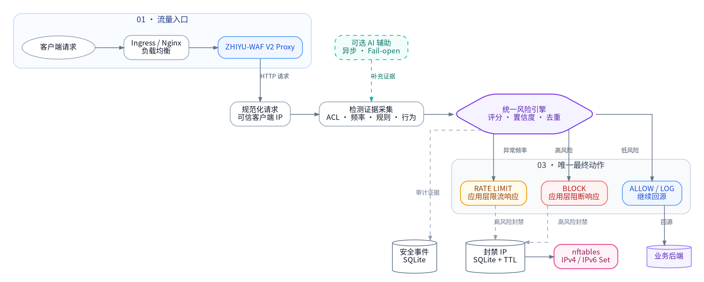

<div align="center">
  

  # ZHIYU-WAF V2

  **本地优先 · 可解释风险决策 · 免费自部署的 Web 应用防火墙**

  [](go.mod)
  [](web/)
  [](#-内核封禁与降级语义)
  [](LICENSE)
  [](#-v2-控制面)
  [](#-设计原则)
  [](#-项目概览)

  [⚡ 快速开始](#-快速开始) · [🗺️ 架构图](#-项目概览) · [🛡️ 核心能力](#-核心能力) · [🧭 部署模式](#-部署模式) · [📡 API](#-v2-控制面) · [✅ 生产清单](#-生产上线清单) · [🤝 参与贡献](#-社区与贡献)
</div>

---

> **ZHIYU-WAF V2 是一个独立演进的开源项目。** 它取消了版本授权、联网激活、功能套餐与专业版门控；代码中已实现的控制面与防护能力均可免费使用。V2 将每次请求的检测证据汇聚到统一风险引擎，并在本地输出唯一、可审计的最终动作。

<div align="center">

| 🏠 本地优先 | 🔎 防护可解释 | 🧯 运行可降级 | 🎛️ 控制面免费 |
| :---: | :---: | :---: | :---: |
| 规则、事件与封禁状态均保留在本地 | 每个动作均可追溯到风险证据 | 内核不可用时仍保留应用层阻断 | AI、站点、情报、RBAC 与大屏直接开放 |

</div>

## ✨ 为什么选择 V2

V2 不把检测器直接等同于阻断器。规则、ACL、频率和行为模块先生成**检测证据**，再由风险引擎按分数、置信度和抑制策略给出一次最终动作。这样的链路既能减少重复阻断，也使安全团队能够从事件、证据和审计记录中理解“为什么这次请求被限流或拦截”。

| 关注点 | V2 的处理方式 | 对运维的意义 |
| --- | --- | --- |
| 多个检测器同时命中 | 汇聚到统一风险引擎后只输出一次最终动作 | 避免重复事件与冲突阻断 |
| 内核封禁不可写 | 明确报告 `degraded`，应用层继续决策与阻断 | 在权限不足时保持可观测的安全降级 |
| AI 服务不可用 | AI 仅提供异步补充证据，核心链路 fail-open | 不让外部依赖决定基础防护是否可用 |
| 多个业务站点 | 每站点维护独立回源和 `monitor` / `protect` / `emergency` 模式 | 可从观察模式渐进切换生产防护 |
| 版本与授权 | 无许可证中心、无激活码、无专业版门控 | 自部署能力透明可用、便于二次开发 |

## 🗺️ 项目概览

ZHIYU-WAF V2 以 Go 反向代理承接业务流量，并在本地完成规范化、访问控制、速率信号、规则匹配、行为分析与风险聚合。规则引擎只产生检测证据，风险引擎统一决定 `allow`、`log`、`rate_limit` 或 `block`；这避免了多个检测器各自阻断造成的重复事件和策略冲突。

外部 AI 是**可选的异步辅助能力**，不是核心防护链的依赖。未配置模型、模型超时或外部网络不可达时，基础规则、风险判定和 HTTP 阻断均继续运行。

<div align="center">
  
</div>

<sub>架构图采用固定分层布局：检测器先产出证据，统一风险引擎只输出一次最终动作；安全事件、封禁 TTL 与 nftables 内核执行相互解耦。可维护源文件见 [`docs/architecture/zhiyu-waf-v2-architecture.dot`](docs/architecture/zhiyu-waf-v2-architecture.dot)。</sub>

### 请求的一次防护旅程

| 阶段 | 发生什么 | 关键输出 |
| --- | --- | --- |
| `01` 流量入口 | 受控入口将请求送入 V2 Proxy | 原始 HTTP 请求与 Host 上下文 |
| `02` 本地决策 | 规范化可信来源 IP，汇聚 ACL、频率、规则、行为与可选 AI 证据 | 风险分数、证据集、置信度 |
| `03` 最终动作 | 风险引擎输出一次 `allow`、`log`、`rate_limit` 或 `block` | 回源、记录、应用层限流或阻断 |
| `04` 状态执行 | 安全事件落库；高风险来源按 TTL 同步封禁集合 | SQLite 审计与 nftables IPv4/IPv6 集合 |

## 🛡️ 核心能力

| 模块 | V2 行为 | 关键价值 | 状态 |
| --- | --- | --- | :---: |
| **本地规则引擎** | 支持 SQL 注入、XSS、命令注入、路径穿越、敏感路径等检测证据 | 检测与最终动作解耦，规则可审计、可维护 | ✅ 本地可用 |
| **统一风险引擎** | 汇聚 ACL、限速、规则、行为与可选 AI 结果 | 每个请求只输出一次最终动作，避免重复阻断 | ✅ 本地可用 |
| **四级风险动作** | `allow`、`log`、`rate_limit`、`block` | 对低风险观测、高风险拦截提供清晰分层 | ✅ 本地可用 |
| **nftables 封禁** | 使用 Go Netlink 管理独立 `zhiyu_waf` 表及 IPv4/IPv6 超时集合 | 不执行 `iptables`、`ip6tables` 或防火墙 shell 命令 | ⚙️ 需权限 |
| **本地安全存储** | SQLite 保存最小化安全事件、站点、封禁与风险决策 | 重启可回放未过期临时封禁，减少状态丢失 | ✅ 本地可用 |
| **多站点防护** | 按域名配置回源与 `monitor`、`protect`、`emergency` 模式 | 支持从观察到正式防护的渐进上线 | ✅ 控制台可管 |
| **治理控制面** | 规则、IP、地理策略、证书、SSH、审计、备份与 RBAC | 白色极简控制台，所有已实现模块均免费开放 | ✅ 免费开放 |
| **AI 辅助分析** | OpenAI 兼容模型、异步 fail-open、配置与审计 | 可选增强，不影响本地核心防护链可用性 | 🧩 按需启用 |

### 设计原则

| 原则 | 说明 |
| --- | --- |
| **Local First** | 防护决策、策略、事件与封禁状态优先在本机完成，不依赖中心化许可证服务。 |
| **Evidence Before Action** | 检测器输出证据，风险引擎根据分数、置信度和策略决定唯一动作。 |
| **Explicit Enforcement** | V2 不使用 `iptables REDIRECT` 劫持业务端口；流量通过显式反代进入 WAF。 |
| **Safe Degradation** | nftables 不可写时仍执行应用层判定与 HTTP 阻断，并公开报告降级状态。 |
| **Privacy by Default** | 安全事件保存定位、关联和审计所需字段，不把完整请求体写入事件表。 |

## 🎯 适用场景

| 场景 | 推荐接入方式 | 建议起点 |
| --- | --- | --- |
| 单体 Web 服务 | Nginx / Caddy / LB 显式转发至 WAF | 先启动 `monitor` 观察规则命中 |
| 多域名与多回源服务 | 在控制台按域名配置站点与回源 | 按站点逐步切换到 `protect` |
| 对抗扫描与自动化攻击 | 启用规则、频率信号、行为画像和 IP 管理 | 关注高风险事件与封禁 TTL |
| 受限容器或无内核权限环境 | 使用应用层阻断与完整事件审计 | 监控 `degraded` 并规划 Capability |
| 需要 AI 辅助研判的安全团队 | 配置脱敏后的兼容模型服务 | 保持 AI 为补充而非核心依赖 |

## ⚡ 快速开始

### 1. 获取代码并构建控制台

> **运行前置：** Go `1.25+`、Node.js `20+`、CGO 可用，以及支持 `nftables` 的 Linux 环境（仅内核封禁需要）。

```bash
git clone https://github.com/JayLee-sre/ZHIYU-WAF.git
cd ZHIYU-WAF

# 构建 Vue 控制台并嵌入 Go 二进制
cd web
npm ci
npm run build:raw
cd ..
rm -rf internal/dashboard/dist
cp -R web/dist internal/dashboard/dist

# 测试与构建
CGO_ENABLED=1 go test ./...
CGO_ENABLED=1 go build -o bin/zhiyu-waf ./cmd/zhiyu-waf
```

### 2. 启动服务并完成初始化

```bash
./bin/zhiyu-waf -config configs/zhiyu-waf.yaml
```

默认情况下，WAF 监听 `:8080`，管理控制台监听 `:9090`。首次运行请完成初始化并立即修改管理员密码；管理端应限制在私有网络、跳板机或受控 VPN 中访问。

| 入口 | 默认地址 | 使用目的 |
| --- | --- | --- |
| 🌐 业务入口 | `http://<host>:8080` | 进入 V2 防护链的 HTTP 流量 |
| 🎛️ 管理控制台 | `http://<host>:9090` | 配置站点、规则、IP、审计与系统设置 |
| 💚 健康检查 | `GET /health` | 快速读取服务健康状态 |
| 🔍 系统状态 | `GET /api/v1/system/status` | 查看防火墙、数据库与运行状态 |
| 📈 指标端点 | `GET /metrics` | 接入 Prometheus 指标采集 |

### 3. 第一次上线的推荐顺序

```text
[创建站点] → [选择 monitor] → [观察风险事件] → [调优规则 / 白名单] → [切换 protect]
```

> **建议：** 不要在未观察业务流量前直接启用严格阻断。先使用 `monitor` 建立基线、处理误报与可信来源，再按业务站点逐步开启 `protect`。

## 🧭 部署模式

### 显式反向代理接入

V2 不再通过 `iptables REDIRECT` 接管业务端口。请让已有的 Ingress、Nginx、负载均衡器或网关显式把业务流量转发到 WAF，再由 WAF 回源到应用服务。

```text
Client
  │
  ▼
Ingress / Nginx / Load Balancer
  │  forwards to WAF :8080
  ▼
ZHIYU-WAF V2 Pipeline
  │  forwards to configured backend
  ▼
Application Backend
```

Nginx 应传递 `Host`、`X-Real-IP` 与 `X-Forwarded-For`。只有 `proxy.trusted_proxies` 中的直接对端才会被信任其转发头；请勿将未受控公网网段加入此列表。

```nginx
location / {
    proxy_pass http://127.0.0.1:8080;
    proxy_set_header Host $host;
    proxy_set_header X-Real-IP $remote_addr;
    proxy_set_header X-Forwarded-For $proxy_add_x_forwarded_for;
    proxy_set_header X-Forwarded-Proto $scheme;
}
```

### 站点防护模式

| 模式 | 适用阶段 | 行为 | 控制台提示 |
| --- | --- | --- | --- |
| `monitor` | 上线前验证、规则调优 | 记录风险证据与事件，不主动执行防护动作 | 🟡 建议作为首个生产阶段 |
| `protect` | 常规生产运行 | 按统一风险决策执行放行、记录、限流或阻断 | 🟢 经过观察后逐步启用 |
| `emergency` | 紧急维护、故障处置 | 优先进入维护策略，便于快速缩小暴露面 | 🔴 仅在处置窗口使用 |

## 🧯 内核封禁与降级语义

V2 的防火墙管理器只操作名为 `zhiyu_waf` 的独立 nftables 表，并维护 IPv4 与 IPv6 封禁集合。内核封禁需要 `CAP_NET_ADMIN` 或宿主机等效权限。

| 运行状态 | WAF 行为 | 运维建议 |
| --- | --- | --- |
| **nftables 可用** | 高风险或人工封禁同步到内核超时集合 | 监控集合写入与封禁 TTL。 |
| **degraded** | 保持规则、风险判定与应用层 HTTP 阻断；内核 IP 封禁不可用 | 检查 Capability、内核支持与 Netlink 错误，并接入告警。 |

| 风险分数 | 默认封禁时长 | 处置建议 |
| ---: | :--- | --- |
| 85–91 | 10 分钟 | 观察短周期重复行为与误报情况。 |
| 92–97 | 1 小时 | 结合规则证据与来源归属复核。 |
| 98–100 | 24 小时 | 作为高置信恶意来源处理并保留审计。 |

SQLite 中尚未到期的临时封禁会在重启时按**剩余时间**回放，不会因重启被无意延长。

## 🧩 配置导航

默认配置见 [`configs/zhiyu-waf.yaml`](configs/zhiyu-waf.yaml)。下面列出生产部署最常需要调整的关键项。

| 配置项 | 说明 | 生产建议 |
| --- | --- | --- |
| `proxy.listen_addr` | WAF HTTP 监听地址 | 使用受控入口或内部地址。 |
| `proxy.backend_addr` | 默认回源服务地址 | 配合站点级回源逐步切换。 |
| `proxy.trusted_proxies` | 可影响真实来源 IP 的可信代理 CIDR/IP | 仅保留直接受控代理。 |
| `dashboard.listen_addr` | 控制台监听地址 | 限制至内网、VPN 或跳板机。 |
| `dashboard.jwt_secret` | 管理会话签名密钥 | 使用随机强密钥或外部密钥管理。 |
| `engine.rules_dir` | 本地 YAML 规则目录 | 通过版本控制或受控发布流程更新。 |
| `storage.path` | SQLite 数据库路径 | 置于可靠磁盘并纳入备份。 |
| `ai.enabled` | 可选 AI 辅助开关 | 先完成数据脱敏与出网审批。 |

## 📡 V2 控制面

所有已实现的控制面能力均免费开放。受 JWT 保护的 V2 API 使用统一包装：成功响应包含 `data` 与 `request_id`；失败响应包含 `error.code`、`error.message` 与 `request_id`。

| 资源 | 常用端点 | 用途 |
| --- | --- | --- |
| 📊 Dashboard 汇总 | `GET /api/v1/dashboard/summary?range=24h` | 请求、阻断、风险来源与类别汇总。 |
| 📈 Dashboard 趋势 | `GET /api/v1/dashboard/timeseries?range=24h` | 时序请求、阻断与高风险变化。 |
| 🧾 安全事件 | `GET /api/v1/events` | 统一查询本地风险事件。 |
| 🔬 事件详情 | `GET /api/v1/events/{id}` | 获取单个事件的证据与最终动作。 |
| 🌐 站点 | `GET/POST /api/v1/sites` | 管理域名、回源、模式和启用状态。 |
| ⛔ 封禁 IP | `GET/POST /api/v1/blocked-ips` | 查看、手工加入或删除本地封禁。 |
| 🩺 系统状态 | `GET /api/v1/system/status` | 查看防火墙、数据库和全功能免费状态。 |
| 📈 可观测性 | `GET /metrics` | 暴露 Prometheus 指标。 |

## 🔐 数据与隐私

安全事件只保存定位、审计与关联所需的最小字段，例如来源 IP、Host、路径、规则标识、风险分数与最终动作。完整请求体不会写入事件表。若启用 AI 辅助，请单独评估数据脱敏、出网审批、供应商条款和业务数据合规要求。

| 数据类别 | 默认处理方式 | 目的 |
| --- | --- | --- |
| 请求定位信息 | 本地存储来源 IP、Host、路径和时间 | 关联风险来源与复现事件上下文 |
| 检测与决策 | 本地存储规则标识、风险分数和最终动作 | 支持解释、审计与误报调优 |
| 完整请求体 | **不写入安全事件表** | 减少敏感业务数据留存面 |
| AI 补充证据 | 仅在显式启用后异步调用外部兼容服务 | 增强研判，不改变本地核心链路 |

## ✅ 生产上线清单

在将生产流量逐步接入 V2 前，建议先在 `monitor` 模式下观察规则命中，再分站点切换到 `protect`。以下项目应在变更窗口前完成验证。

- [ ] 回源可达性、上传、流式响应与 WebSocket 兼容性符合业务预期。
- [ ] 可信代理列表仅包含受控直接对端，来源 IP 不可被伪造。
- [ ] 规则误报处置、IP 白名单与站点模式切换流程已经演练。
- [ ] IPv4/IPv6 封禁、nftables 降级告警和重启回放均已验证。
- [ ] SQLite 数据库、配置文件和规则目录已纳入备份与恢复演练。
- [ ] 管理控制台已限制在受控网络，并启用强管理员密码与最小权限账户。
- [ ] 安全事件、审计日志与 Prometheus 指标已接入团队既有监控流程。

## 🧰 仓库导览

```text
.
├── cmd/zhiyu-waf/              # 服务入口与 V2 初始化
├── configs/                    # 默认配置示例
├── internal/core/              # V2 本地防护流水线
├── internal/risk/              # 统一风险引擎与决策逻辑
├── internal/firewall/nftables/ # Netlink nftables 管理器
├── internal/dashboard/         # REST API 与嵌入式控制台资源
├── web/                        # Vue 3 管理控制台
├── docs/architecture/          # 架构图可维护源文件
└── docs/images/                # README 文档图像资产
```

## 🧪 开发与质量检查

```bash
# 前端生产构建
cd web && npm ci && npm run build:raw && cd ..
rm -rf internal/dashboard/dist && cp -R web/dist internal/dashboard/dist

# 服务端测试、竞态检查与静态检查
CGO_ENABLED=1 go test ./...
go test -race ./...
go vet ./...
CGO_ENABLED=1 go build ./cmd/zhiyu-waf
```

## 🤝 社区与贡献

欢迎通过 [Issue](https://github.com/JayLee-sre/ZHIYU-WAF/issues)、讨论和 Pull Request 参与 V2 演进。提交前请保证代码通过格式检查、测试与构建，并清楚说明变更的防护语义、兼容影响和验证步骤。对于规则、风险策略和防火墙相关修改，请同时提供可复现的安全事件样例或测试用例。

| 贡献方向 | 建议内容 |
| --- | --- |
| 🐛 缺陷反馈 | 提供版本、部署方式、最小复现步骤和脱敏日志。 |
| 🛡️ 规则贡献 | 说明威胁场景、命中样例、误报边界与测试用例。 |
| 📚 文档改进 | 补充部署实践、兼容矩阵与安全运维说明。 |
| 🧩 功能开发 | 描述防护语义、API 影响、迁移方案与验证结论。 |

## 📄 许可证

本项目采用 [AGPL-3.0](LICENSE) 许可证。将本项目用于网络服务、再分发或二次交付前，请评估相应的开源义务。

---

<div align="center">
  <strong>🛡️ ZHIYU-WAF V2</strong><br/>
  <sub>Local First · Evidence Driven · Free Control Plane</sub>
</div>
